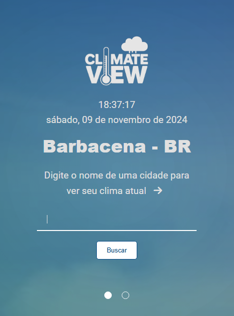
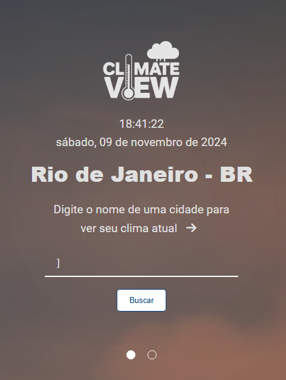
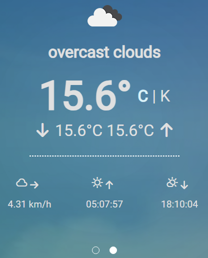
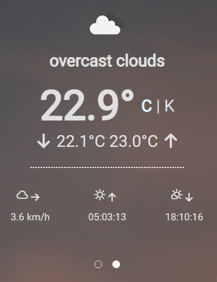
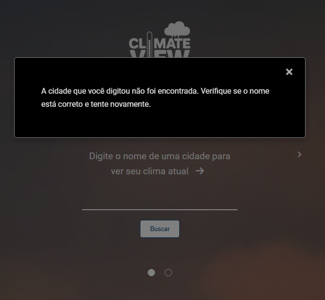
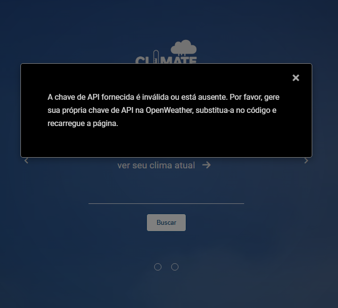

# ClimateView 🌍

O **ClimateView** é uma aplicação web interativa que permite consultar as condições climáticas atuais de qualquer cidade do mundo. A interface é simples e moderna, utilizando o **Materialize CSS** para estilização e a API do OpenWeather para fornecer dados climáticos em tempo real. 

**Projeto desenvolvido para a disciplina de WebService na graduação em Sistemas para Internet**

## Funcionalidades

- 🔍 **Busca por cidade**: O usuário pode digitar o nome de uma cidade para obter informações sobre o clima atual. 
- 🌡️ **Temperatura atual**: Exibição da temperatura atual em Celsius (com opção de conversão para Kelvin).
- ⚙️ **Detalhes adicionais**: Informações sobre a velocidade do vento, hora do nascer e do pôr do sol.
- 🖼️ **Design responsivo**: A interface se adapta a diferentes dispositivos.
- 🌈 **Alteração de fundo:** Dependendo da temperatura, a cor de fundo da página muda. Quando a temperatura é quente, o fundo fica em tons de vermelho, e quando é mais fria, em tons de azul. Possuindo até 10 variações de cores.

## Funcionalidades Detalhadas

### 1. **Página inicial**
A página inicial permite que o usuário insira o nome de uma cidade e visualize as informações sobre o clima.

- **Logo**: Um logo representando o ClimateView.
- **Campo de busca**: O usuário digita o nome da cidade para realizar a consulta.
- **Data e hora**: Exibição da data e hora atuais.

### 2. **Página de resultados**
Após a pesquisa, a aplicação exibe as informações sobre o clima da cidade buscada:

- **Temperatura atual**: A temperatura é exibida junto com os ícones de variação de temperatura (máxima e mínima).
- **Ícones de clima**: Ícones representando as condições climáticas, como sol, nuvens e chuva.
- **Velocidade do vento** e **hora do nascer e pôr do sol**.

### 3. **Modal de erro**
Caso haja um erro na busca ou na chave de API, a aplicação exibe um modal com a mensagem de erro.

## Tecnologias Utilizadas

- **HTML5**: Estrutura da página.
- **CSS3**: Estilização usando **Materialize CSS** e **Font Awesome** para ícones.
- **JavaScript**: Interatividade, incluindo manipulação de tempo, data e consultas à API do OpenWeather.
- **API do OpenWeather**: Utilizada para buscar informações climáticas.

## Como Usar

1. Clone este repositório ou baixe os arquivos.
2. Substitua a variável `KEY_API` com sua chave da API do OpenWeather.
3. Abra o arquivo `index.html` no seu navegador.
